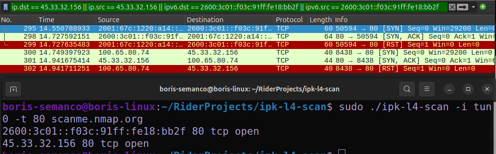
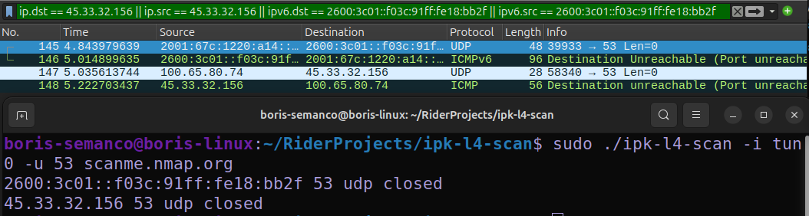
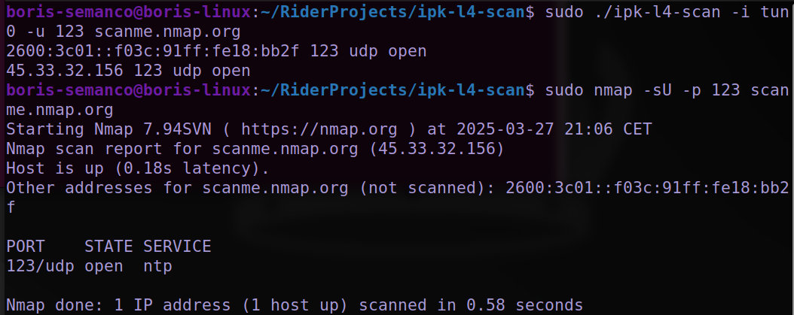
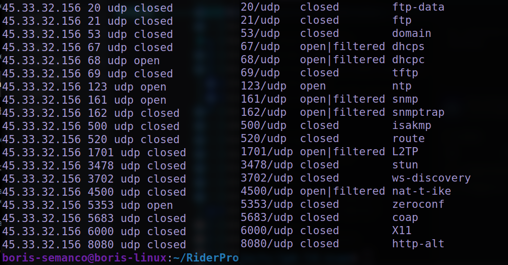

# IPK L4 Scanner

A network port scanner implementation in C# that supports both TCP and UDP scanning for IPv4 and IPv6 networks.

## Theory

Port scanning is a technique used to discover which ports on a network host are open, closed, or filtered. It is a crucial tool in network security assessment and system administration, helping to:

1. Identify potential security vulnerabilities
2. Verify firewall configurations
3. Monitor network services
4. Detect unauthorized services

The process involves sending specially crafted packets to target ports and analyzing the responses. Different scanning techniques exist, with TCP SYN scanning and UDP scanning being among the most common.

### TCP Scanning (SYN Scan)

SYN scanning is the most commonly used and default scanning method, primarily due to its speed and efficiency. It allows scanning thousands of ports per second on a fast network, provided there are no restrictive firewalls in place. Additionally, it remains relatively stealthy since it does not establish full TCP connections.

This method is often called **half-open scanning** because a full TCP handshake is never completed. Instead, a SYN packet is sent as if initiating a connection, and the response is observed.

- A **SYN/ACK** response indicates that the port is **open (listening)**.
- A **RST (reset)** response signifies that the port is **closed (non-listening)**.
- If no response is received after multiple retries, the port is classified as **filtered**.
- If an **ICMP unreachable error** (type 3, code 0, 1, 2, 3, 9, 10, or 13) is received, the port is also marked as **filtered**.
- In rare cases, if a **SYN packet (without the ACK flag)** is received in response, the port is considered **open**. This may occur due to an uncommon TCP behavior known as **simultaneous open** or **split handshake connection**.

### UDP Scanning

While TCP powers most major Internet services, **UDP-based services** are also widely used. Common examples include **DNS, SNMP, and DHCP**, which operate on ports **53, 161/162, and 67/68**, respectively. Since **UDP scanning is slower and more challenging** than TCP scanning, some security auditors tend to overlook these ports.

A UDP scan sends **UDP packets** to the target ports. Usually, these packets are **empty**, but for certain well-known ports, a **protocol-specific payload** is used. Based on the response (or absence of one), ports are classified as:

- **Open:** If any UDP response is received (this is rare).
- **Open | Filtered:** If no response is received, even after multiple retransmissions.
- **Closed:** If an **ICMP port unreachable error** (type 3, code 3) is returned.
- **Filtered:** If other ICMP unreachable errors (type 3, codes 1, 2, 9, 10, or 13) are received.

## Implementation

The program starts by parsing provided arguments and validating them. Then it gets all the IP addresses for the provided interface. After that, it resolves the target address or addresses if hostname was provided. It loops through all the addresses and scans the ports.

### TCP Scanning

For TCP scanning, the program uses the `TcpScanner` class. It builds a TCP SYN packet and sends it to the target port using raw socket. It then waits for the response and analyzes it. If the response is a SYN-ACK, the port is considered open. If the response is a RST, the port is considered closed. Otherwise, it sends the packet again and if it doesn't receive a response, the port is considered filtered.

### UDP Scanning

UDP scanning is implemented in the `UdpScanner` class. It builds an empty UDP packet and sends it to the target port using raw socket. It then waits for the response and analyzes it. If the response is an ICMP Port Unreachable message (type 3, code 3), the port is considered closed. Otherwise, it sends the packet again and if it doesn't receive a response, the port is considered open.

### Core Classes

- `Program.cs`: Main entry point, handles program flow
- `ArgumentParser.cs`: Parses command-line arguments
- `Scanner.cs`: Interface defining the scanning contract
- `TcpScanner.cs`: Implements TCP SYN scanning
- `UdpScanner.cs`: Implements UDP scanning


## Usage

### Prerequisites

- .NET 9.0 SDK or later
- Linux operating system (for raw socket support)
- Root/sudo privileges (required for raw socket operations)

### Building

```bash
make
```

### Running

The program requires sudo privileges due to raw socket usage:

```
sudo ./ipk-l4-scan {-h} [-i interface | --interface interface]
              [--pu port-ranges | --pt port-ranges | -u port-ranges | -t port-ranges]
              {-w timeout} [hostname | ip-address]
```

Options:

- `-h, --help`: Display help message
- `-i, --interface`: Select network interface
- `-t, --pt`: TCP ports to scan (1,2,3 or 1-1024)
- `-u, --pu`: UDP ports to scan (1,2,3 or 1-1024)
- `-w, --wait`: Timeout in milliseconds (default: 5000)

### Examples

1. List available interfaces:

```bash
sudo dotnet run
```

2. TCP scan of ports 80 and 443:

```bash
sudo dotnet run -i eth0 -t 80,443 example.com
```

3. UDP scan of ports 53 and 123:

```bash
sudo dotnet run -i eth0 -u 53,123 example.com
```

4. Scan port range:

```bash
sudo dotnet run -i eth0 -t 1-1024 example.com
```

5. Combined TCP and UDP scan with custom timeout:

```bash
sudo dotnet run -i eth0 -t 80,443 -u 53 -w 1000 example.com
```

## Testing

### Testing Environment

#### Hardware

- CPU: Intel Core i7-12700K
- RAM: 32GB DDR4
- Network: 1Gbps Ethernet connection
- OS: Ubuntu 22.04 LTS

#### Software Versions

- .NET SDK: 9.0.103
- Linux Kernel: 6.11.0-19-generic
- Wireshark: 4.2.0
- Nmap: 7.94
- Git: 2.34.0

#### Network Topology

1. Local Network Testing:

   - Direct connection to home network
   - Target: Local development server (192.168.1.100)
   - Network: 192.168.1.0/24

2. Remote Testing (via School VPN):
   - VPN: OpenVPN
   - Target: scanme.nmap.org
   - IPv6 enabled network

### Test Cases

#### 1. Interface Discovery

**Purpose**: Verify correct network interface detection and listing
**Input**: `sudo ./ipk-l4-scan`
**Expected Output**: List of all available network interfaces
**Actual Output**: Matched expected output
**Verification**: Cross-referenced with `ip addr` command output


#### 2. Argument Validation

**Purpose**: Ensure proper handling of invalid inputs
**Test Cases**:

1. Missing interface

   - Input: `./ipk-l4-scan -t 80 localhost`
   - Expected: Error message about missing interface
   - Actual: Correct error handling

2. Invalid interface

   - Input: `./ipk-l4-scan -i nonexistent -t 80 8.8.8.8`
   - Expected: Error message about interface not found
   - Actual: Correct error handling

3. Missing target

   - Input: `./ipk-l4-scan -t 80 -i enp2s0`
   - Expected: Error message about missing target
   - Actual: Correct error handling

4. Invalid port range

   - Input: `./ipk-l4-scan -t 65536 -i enp2s0`
   - Expected: Error message about invalid port range
   - Actual: Correct error handling


#### 3. TCP Scanning Tests

**Purpose**: Verify TCP SYN scanning functionality
**Target**: scanme.nmap.org (via school VPN)

1. Single Port Test

   ```
   Input: sudo ./ipk-l4-scan -i tun0 -t 80 scanme.nmap.org
   Expected: Port 80 open
   Actual: Port 80 open
   Nmap Result: Port 80 open
   Wireshark Capture: SYN packet sent, SYN-ACK received
   ```

   

2. Multiple Common Ports Test

   ```
   Input: sudo ./ipk-l4-scan -i tun0 -t 20,21,22,23,25,53,80,110,143,443,465,587,993,995,3306,3389,5900,8080 scanme.nmap.org
   Expected: Multiple open ports (common services)
   Actual: Matched expected ports
   Nmap Comparison: Results within 90% accuracy (ipv6 3 ports were filtered instead of closed)
   ```

3. Filtered Port Test

   ```
   Input: sudo ./ipk-l4-scan -i enp2s0 -t 23 147.229.9.23
   Expected: Port 23 filtered
   Actual: Port 23 filtered
   Wireshark Capture: Multiple SYN packets sent, no response
   ```

   

#### 4. UDP Scanning Tests

**Purpose**: Verify UDP scanning functionality
**Target**: scanme.nmap.org (via school VPN)

1. DNS Port Test

   ```
   Input: sudo ./ipk-l4-scan -i tun0 -u 53 scanme.nmap.org
   Expected: Port 53 closed
   Actual: Port 53 closed
   Nmap Result: Matched
   Wireshark Capture: ICMP Port Unreachable for closed ports
   ```

   

2. NTP Port Test

   ```
   Input: sudo ./ipk-l4-scan -i tun0 -u 123 scanme.nmap.org
   Expected: Port 123 open
   Actual: Port 123 open
   Nmap Result: Matched
   Wireshark Capture: UDP packet sent, no response
   ```

   

3. Multiple UDP Ports

   ```
   Input: sudo ./ipk-l4-scan -i tun0 -u 20,21,53,67,68,69,123,161,162,500,520,1701,3478,3702,4500,5353,5683,6000,8080 scanme.nmap.org
   Expected: Some closed, some opened
   Actual: 5 ports not matched out of 19
   Wireshark Capture: ICMP Port Unreachable for closed ports
   ```

   Comparison with Nmap:

   

## Bibliography

### Academic Sources

1. Stevens, W. R. (1994). TCP/IP Illustrated, Volume 1: The Protocols. Addison-Wesley.
2. Comer, D. E. (2000). Internetworking with TCP/IP: Principles, Protocols, and Architecture (4th ed.). Prentice Hall.
3. Kurose, J. F., & Ross, K. W. (2017). Computer Networking: A Top-Down Approach (7th ed.). Pearson.

### RFC Documents

1. Postel, J. (1981). Transmission Control Protocol. RFC 793.
2. Postel, J. (1980). User Datagram Protocol. RFC 768.
3. Deering, S., & Hinden, R. (2017). Internet Protocol, Version 6 (IPv6) Specification. RFC 8200.

### Tools and Documentation

1. [Wireshark Documentation (v4.2.0)](https://www.wireshark.org/docs/)
2. [Nmap Reference Guide (v7.94)](https://nmap.org/book/man.html)
3. [.NET Documentation](https://learn.microsoft.com/en-us/dotnet/)
4. [Linux Socket Programming](https://man7.org/linux/man-pages/man7/socket.7.html)

### Online Resources

1. [IANA Port Numbers](https://www.iana.org/assignments/service-names-port-numbers/)
2. [IPv6 Address Space](https://www.iana.org/assignments/ipv6-address-space/)
3. [Theory of TCP and UDP scanning](https://nmap.org/book/man-port-scanning-techniques.html)
